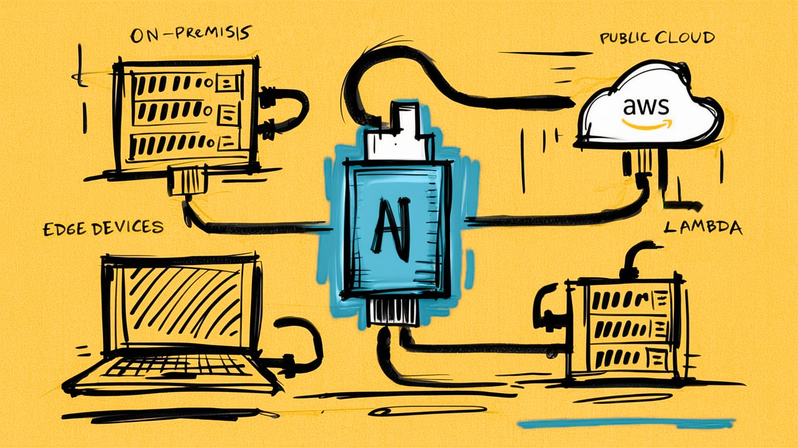
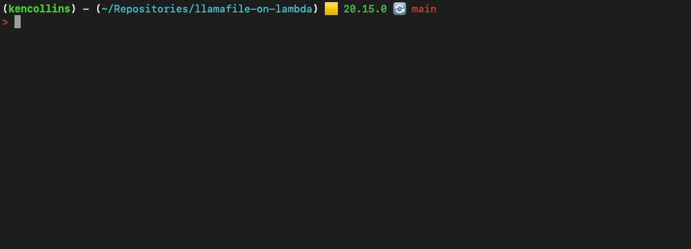

# Serverless AI Inference with Gemma 2 using Mozilla's llamafile on AWS Lambda

https://www.unremarkable.ai/serverless-ai-inference-with-gemma-2-using-mozillas-llamafile-on-aws-lambda



## Setup

We assume you have the following configured or installed.

1. An AWS account with credentials configured.
2. The [AWS SAM CLI](https://docs.aws.amazon.com/serverless-application-model/latest/developerguide/install-sam-cli.html) installed for fast and easy serverless deployments.
3. Docker [installed](https://www.docker.com) for easy container builds and deployments.

After you clone the repo, setup your dependencies with the following command:

```shell
npm install
```

## Usage

Now you can run the following commands from the root directory.

* `./bin/build` - To download  and build a llamafile container for deployment.
* `./bin/server` - To run the download (above) llamafile server locally.
* `./bin/deploy` - Deploy to AWS Lambda. Also does a build if needed.

## Chat

This project uses [Inquirer.js](https://www.npmjs.com/package/inquirer) to chat with the model using OpenAI's API. The model can be running locally using `bin/server` or deployed to Lambda using `bin/deploy`. Inquirer will ask for your local or function URL at the beginning of the chat session.


